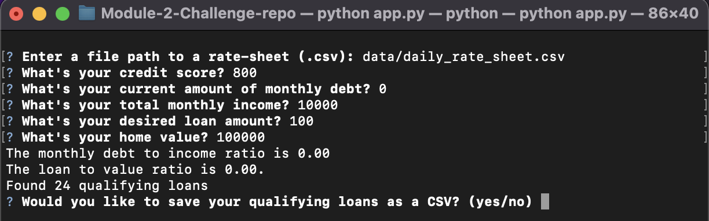
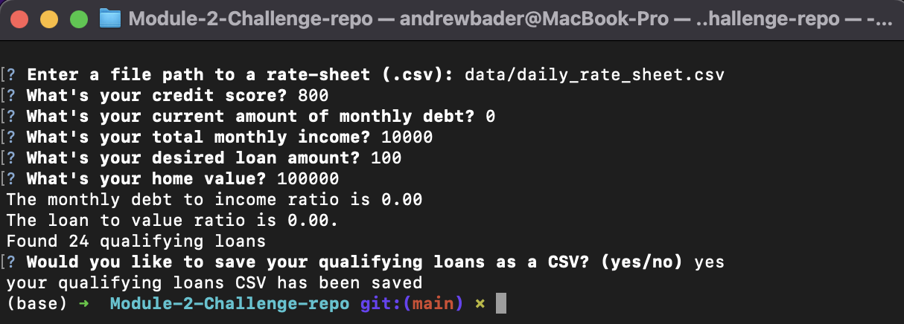
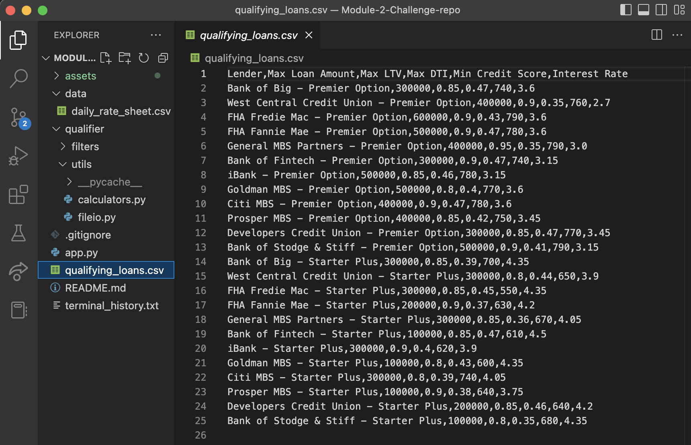
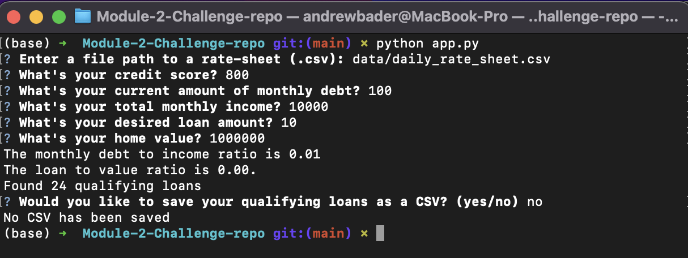
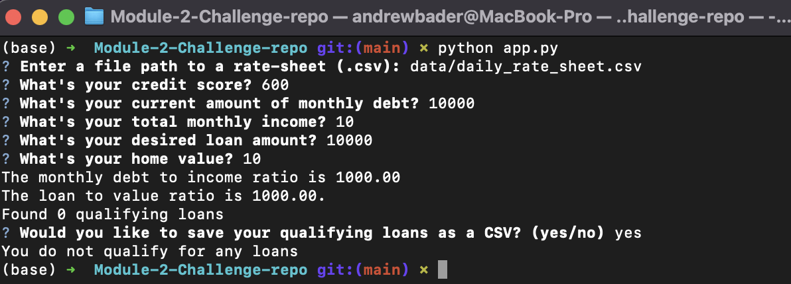

# Module-2-Challenge-repo
Columbia Fintech Bootcamp Module 2 Challenge
Due: 12/14/2022
By: Andrew Ryan Bader

# Project Title

Loan Qualifier App: The purpose of this app is for a user to have the ability to save a set of qualifying loans to a CSV file in order to share the results as a spreadsheet.

---

## Technologies

This project uses the Python. This project uses sys, fire, questionary, pathlib and csv libraries.

---

## Installation Guide

To clone and use:
1) make a local directory for this github repository
2) clone down this repo with git clone command
3) cd into cloned repo
4) run the program with python command in cli
5) follow loan-qualifier-tool prompts

---

## Usage

Functionality:
When the qualifier is ran, the tool prompts the user to save the results as a CSV file (or not if user opts out). If no loans exist, the program should notify the user and exit. The tool will prompt for a file path to save the file. The tool saves the results as a CSV file

Modules and Directories:
app.py: the primary application file. The save_qualifying_loans function is here:

    def save_qualifying_loans(qualifying_loans):
        """Saves the qualifying loans to a CSV file.

        Args:
            qualifying_loans (list of lists): The qualifying bank loans.
        """
        # @TODO: Complete the usability dialog for savings the CSV Files.
        # YOUR CODE HERE!

        # prompted asking if client wants to save CSV
        answer = questionary.text("Would you like to save your qualifying loans as a CSV? (yes/no)").ask()
        # Responses to prompts
        message_saved = "your qualifying loans CSV has been saved"
        message_no_qualifying_loans = "You do not qualify for any loans"
        message_no_csv = "No CSV has been saved"

        # conditional depending on client's selection
        if answer == 'yes':
            if len(qualifying_loans) != 0:
            # invoking save csv file, integrating save_csv function into application
                save_csv(qualifying_loans)
                print(message_saved)
            else:
                print(message_no_qualifying_loans)
    
        else:
            print(message_no_csv)

data directory: includes the CSV file
qualifier folder: contains functions imported into the main app
filters: directory that contains .py files for filter functions

utils: includes financial calculator module and fileio module
    the fileio.py file in this directory has the save_csv function:

    def save_csv(qualifying_loans):
        # Set the output header
        header = ['Lender', 'Max Loan Amount', 'Max LTV', 'Max DTI', 'Min Credit Score', 'Interest Rate']

        # Set the output file path
        output_path = Path("qualifying_loans.csv")

        with open(output_path, 'w', newline='') as csvfile:
            csvwriter = csv.writer(csvfile)
            csvwriter.writerow(header)
        
            for loan in qualifying_loans:
                csvwriter.writerow(loan)

Usage screen shots:
1) Go through prompts and answer questions about income, debt, etc.

2) Chose yes/no for the save CSV prompt

3a) If chose yes, find CSV in directory root

3b) If chose no, program exits

3c) If client doesn't qualify for loan

---

## Contributor

Andrew Ryan Bader

---

## License

N/A
